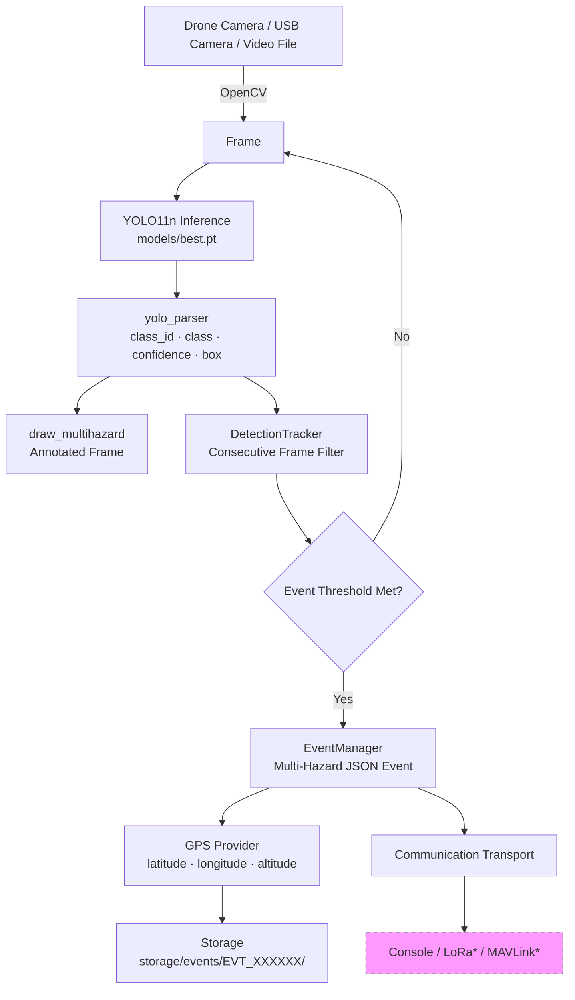

# AI Multi-Hazard Drone Detection System
### Smart India Hackathon 2026 — Edge AI on Raspberry Pi 4B

> **YOLO11n** running on a **Raspberry Pi 4B** detects six disaster hazards from aerial drone footage in real time, generating geo-tagged rescue events.

---

## What This System Does

Instead of streaming raw video, the drone's onboard computer understands the scene:

| Class | Hazard | Priority |
|-------|--------|----------|
| 0 | 🌊 Flood | HIGH |
| 1 | 🌫 Smoke | MEDIUM |
| 2 | 🔥 Fire | HIGH |
| 3 | 🧱 Debris | LOW |
| 4 | ⛰ Landslide | HIGH |
| 5 | 👤 Person (Survivor) | **CRITICAL** |

Every detection above the confidence threshold becomes a **structured JSON event** stored on-device and ready for telemetry.

---

## Current Implementation Status

| Module | Status |
|--------|--------|
| 6-class YOLO11n detector (`models/best.pt`) | ✅ Implemented |
| YOLO inference pipeline | ✅ Implemented |
| Multi-hazard visualization | ✅ Implemented |
| Event engine (multi-detection per frame) | ✅ Implemented |
| Temporal tracker (false-positive reduction) | ✅ Implemented |
| JSON configuration system | ✅ Implemented |
| CLI entry point (`python -m raspberry_pi.main`) | ✅ Implemented |
| Communication interface (base + Console/Null) | ✅ Implemented |
| GPS interface (base + Null + Simulator) | ✅ Implemented |
| Real GPS hardware (serial UART) | 🔜 Not Yet Implemented |
| LoRa telemetry transport | 🔜 Not Yet Implemented |
| MAVLink flight controller integration | 🔜 Not Yet Implemented |
| Thermal camera fusion | 🔜 Future Work |
| Autonomous navigation / SLAM | 🔜 Out of Scope |
| Ground station dashboard | 🔜 Future Work |

---

## Architecture



> *LoRa and MAVLink transports are not yet implemented. See `raspberry_pi/docs/hardware_integration.md`.

---

## Repository Structure

```
Detection_Model/
│
├── README.md
├── LICENSE
├── CONTRIBUTING.md
├── CHANGELOG.md
├── requirements.txt
├── requirements-rpi.txt
├── .gitignore
├── .gitattributes
│
├── models/
│   ├── best.pt                  ← Trained YOLO11n weights (5.4 MB)
│   └── model_metadata.json      ← Verified class mapping + SHA256
│
├── raspberry_pi/
│   ├── main.py                  ← Single entry point
│   │
│   ├── inference/
│   │   ├── class_config.py      ← Authoritative class mapping (runtime)
│   │   ├── class_colors.py      ← BGR colors per class
│   │   ├── yolo_parser.py       ← Ultralytics → detection dicts
│   │   ├── draw_multihazard.py  ← Annotate all detections on frame
│   │   └── live_inference.py    ← Inference loop (camera/video/image)
│   │
│   ├── event_engine/
│   │   ├── event_manager.py     ← Multi-hazard event creation + storage
│   │   └── tracker.py           ← Consecutive-frame false-positive filter
│   │
│   ├── communication/
│   │   ├── interface.py         ← Transport base + Console + Null + stubs
│   │   └── gps_provider.py      ← GPS base + Null + Simulator + stub
│   │
│   ├── config/
│   │   ├── classes.json         ← Class ID → name mapping (source of truth)
│   │   ├── priorities.json      ← Hazard priority levels
│   │   ├── event_schema.json    ← Reference event structure
│   │   ├── model.json           ← Weights path, conf, iou, device
│   │   ├── camera.json          ← Camera source, resolution, FPS
│   │   └── telemetry.json       ← Transport config
│   │
│   ├── storage/
│   │   └── events/              ← Auto-created event folders (EVT_000001/ ...)
│   │
│   └── docs/
│       ├── architecture.md
│       ├── deployment.md
│       ├── event_engine.md
│       ├── telemetry.md
│       └── hardware_integration.md
│
├── scripts/                     ← Dataset preparation utilities (local use)
│
└── tests/
    ├── test_paths.py
    ├── test_config.py
    ├── test_parser.py
    └── test_event_manager.py
```

---

## Tech Stack

| Layer | Technology |
|-------|-----------|
| AI Model | YOLO11n (Ultralytics) |
| Deep Learning | PyTorch |
| Computer Vision | OpenCV |
| Language | Python 3.11+ |
| Edge Hardware | Raspberry Pi 4 Model B |
| Camera | USB Camera / Raspberry Pi Camera Module |
| GPS | *(interface ready — hardware not yet integrated)* |
| Telemetry | *(interface ready — LoRa/MAVLink not yet integrated)* |

---

## Quick Start — Local PC Test

```bash
# 1. Clone
git clone https://github.com/Sohel808035/Detection_Model.git
cd Detection_Model

# 2. Virtual environment
python -m venv venv
source venv/bin/activate        # Linux/macOS
venv\Scripts\activate           # Windows

# 3. Dependencies
pip install -r requirements.txt

# 4. Verify model
python -c "from ultralytics import YOLO; m = YOLO('models/best.pt'); print(m.names)"
# Expected: {0: 'flood', 1: 'smoke', 2: 'fire', 3: 'debris', 4: 'landslide', 5: 'person'}

# 5. Help
python -m raspberry_pi.main --help

# 6. Run on a video file (no display needed)
python -m raspberry_pi.main --source path/to/video.mp4 --device cpu --max-frames 30

# 7. Run with display (requires GUI)
python -m raspberry_pi.main --source 0 --device cpu --show
```

---

## Raspberry Pi Deployment

> See [`raspberry_pi/docs/deployment.md`](raspberry_pi/docs/deployment.md) for the complete step-by-step guide.

```bash
# On Raspberry Pi OS:
git clone https://github.com/Sohel808035/Detection_Model.git
cd Detection_Model

python3 -m venv venv
source venv/bin/activate
pip install -r requirements-rpi.txt

# Run headless inference (no display):
python -m raspberry_pi.main --source 0 --device cpu
```

---

## Configuration

All runtime parameters live in `raspberry_pi/config/`.

### `model.json`
```json
{
  "weights": "models/best.pt",
  "backend": "auto",
  "imgsz": 640,
  "confidence": 0.20,
  "iou": 0.45,
  "device": "auto"
}
```

### `camera.json`
```json
{
  "source": 0,
  "width": 640,
  "height": 480,
  "fps": 30,
  "display": false,
  "save_output": false
}
```

Set `"source"` to a video file path for testing without a live camera.

---

## Example Event JSON

A single frame with three hazards becomes **one multi-detection event**:

```json
{
  "event_id": "EVT_000001",
  "timestamp": "2026-09-19T12:30:00Z",
  "priority": "CRITICAL",
  "latitude": null,
  "longitude": null,
  "altitude": null,
  "detections": [
    { "class_id": 2, "class": "fire",   "confidence": 0.91, "box": [120, 80,  250, 320] },
    { "class_id": 1, "class": "smoke",  "confidence": 0.84, "box": [ 80, 20,  300, 180] },
    { "class_id": 5, "class": "person", "confidence": 0.88, "box": [340, 190, 390, 320] }
  ],
  "people_count": 1,
  "image_path": "raspberry_pi/storage/events/EVT_000001/frame.jpg"
}
```

**Priority** is determined by the highest-priority hazard in the frame. Person = CRITICAL overrides everything.

---

## Model Information

| Property | Value |
|----------|-------|
| Architecture | YOLO11n |
| Task | Object Detection |
| Classes | 6 |
| File | `models/best.pt` |
| Size | ~5.4 MB |
| Training | 100 epochs on custom merged aerial dataset |

> mAP, precision, and recall were not exported with this release. See local training logs in `runs/detect/` (excluded from repository).

---

## Troubleshooting

| Problem | Fix |
|---------|-----|
| `Model not found: models/best.pt` | Make sure `models/best.pt` exists or update `model.json` |
| `Cannot open camera index 0` | No camera connected or in use by another app |
| `ModuleNotFoundError: ultralytics` | Run `pip install -r requirements.txt` |
| High CPU on Raspberry Pi | Reduce `imgsz` to 320 in `model.json` |
| `torch.cuda.is_available()` = False | Normal on Raspberry Pi — CPU is used automatically |

---

## Not Yet Implemented

The following features have clean interface stubs in the codebase but require additional hardware and integration work:

- **GPS** — `raspberry_pi/communication/gps_provider.py` → `SerialGPSProvider`
- **LoRa Telemetry** — `raspberry_pi/communication/interface.py` → `LoRaTransport`
- **MAVLink** — `raspberry_pi/communication/interface.py` → `MAVLinkTransport`
- **Thermal Camera Fusion** — Future work
- **SLAM / Autonomous Navigation** — Out of scope for this AI repository

---

## Future Roadmap

- [ ] GPS hardware integration (NEO-M8N via UART)
- [ ] LoRa telemetry (compact event transmission)
- [ ] MAVLink flight controller integration
- [ ] Ground station dashboard (web UI)
- [ ] RGB + Thermal fusion
- [ ] Multi-drone coordination
- [ ] SLAM-based GPS-denied navigation
- [ ] ONNX export for faster CPU inference on Raspberry Pi

---

## Developer Handoff

A new Raspberry Pi developer needs:

1. Clone this repository
2. Copy `models/best.pt` (already in repo, ~5.4 MB)
3. `pip install -r requirements-rpi.txt`
4. Configure `raspberry_pi/config/camera.json` with the correct camera source
5. Run `python -m raspberry_pi.main --source 0 --device cpu`
6. For GPS: implement `SerialGPSProvider` in `communication/gps_provider.py`
7. For telemetry: implement `LoRaTransport` in `communication/interface.py`

**No local author knowledge is required.**

---

## Running Tests

```bash
pip install pytest
python -m pytest tests/ -v
```

---

## Author

**Sohel Tamboli** — AI · Backend · Edge Intelligence  
Smart India Hackathon 2026
