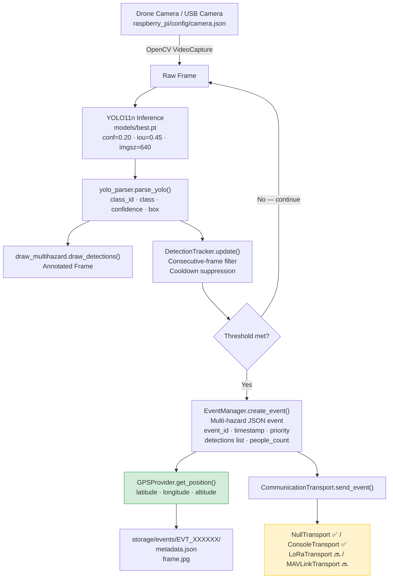
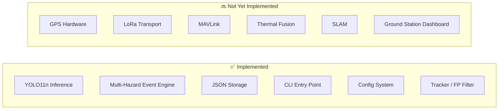

# Architecture

## System Overview



---

## Module Responsibilities

| Module | Responsibility |
|--------|---------------|
| `raspberry_pi/main.py` | CLI, config loading, wiring all components |
| `inference/live_inference.py` | Camera/video loop, model predict() |
| `inference/yolo_parser.py` | Ultralytics → clean detection dicts |
| `inference/draw_multihazard.py` | OpenCV annotation |
| `inference/class_config.py` | Authoritative class map (loads classes.json) |
| `inference/class_colors.py` | BGR colors per class |
| `event_engine/event_manager.py` | Multi-detection event creation + JSON storage |
| `event_engine/tracker.py` | Consecutive-frame threshold + cooldown |
| `communication/interface.py` | Transport abstraction |
| `communication/gps_provider.py` | GPS abstraction |

---

## Data Flow — Single Frame

```
Camera frame (BGR numpy array)
    │
    ▼ YOLO11n predict()
[{class_id:2, class:'fire', conf:0.91, box:[...]},
 {class_id:5, class:'person', conf:0.88, box:[...]}]
    │
    ▼ DetectionTracker.update()
Filtered list (only classes that met consecutive-frame threshold)
    │
    ▼ EventManager.create_event()
{
  "event_id": "EVT_000001",
  "priority": "CRITICAL",
  "detections": [...],
  "people_count": 1,
  "latitude": null, "longitude": null, "altitude": null,
  "image_path": "...frame.jpg"
}
    │
    ├─▶ Written to storage/events/EVT_000001/metadata.json
    └─▶ CommunicationTransport.send_event()
```

---

## What Is and Is Not Implemented


