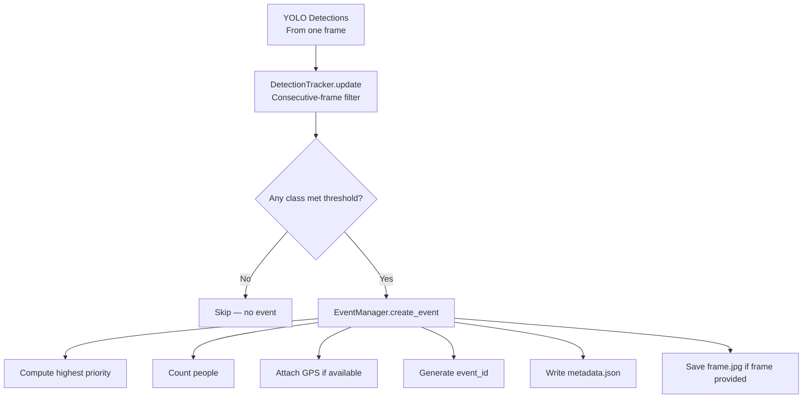

# Event Engine Documentation

## Overview

The Event Engine converts raw YOLO detections into structured, persistent rescue events.

**A single frame with multiple hazards becomes ONE event with multiple detections — not separate events.**

---

## Pipeline



---

## Consecutive-Frame Rules

These are **engineering heuristics** — not proof of zero false positives.

| Class | Frames Required | Cooldown |
|-------|----------------|----------|
| person | 1 (immediate) | 5 sec |
| fire | 3 | 8 sec |
| flood | 2 | 10 sec |
| landslide | 2 | 10 sec |
| smoke | 5 | 15 sec |
| debris | 3 | 20 sec |

---

## Event Structure

```json
{
  "event_id": "EVT_000001",
  "timestamp": "2026-09-19T07:00:00Z",
  "priority": "CRITICAL",
  "latitude": null,
  "longitude": null,
  "altitude": null,
  "detections": [
    {
      "class_id": 2,
      "class": "fire",
      "confidence": 0.91,
      "box": [120, 80, 250, 320]
    },
    {
      "class_id": 1,
      "class": "smoke",
      "confidence": 0.84,
      "box": [80, 20, 300, 180]
    },
    {
      "class_id": 5,
      "class": "person",
      "confidence": 0.88,
      "box": [340, 190, 390, 320]
    }
  ],
  "people_count": 1,
  "image_path": "raspberry_pi/storage/events/EVT_000001/frame.jpg"
}
```

**Priority is determined by the highest-priority hazard in the frame:**
`CRITICAL > HIGH > MEDIUM > LOW`

In the example above, `person = CRITICAL` overrides `fire = HIGH`.

---

## Storage

Each event creates a folder under `raspberry_pi/storage/events/`:

```
storage/events/
├── EVT_000001/
│   ├── metadata.json
│   └── frame.jpg
├── EVT_000002/
│   ├── metadata.json
│   └── frame.jpg
```

---

## GPS

GPS coordinates are `null` until actual GPS hardware is integrated.  
See `raspberry_pi/communication/gps_provider.py` and `raspberry_pi/docs/hardware_integration.md`.
